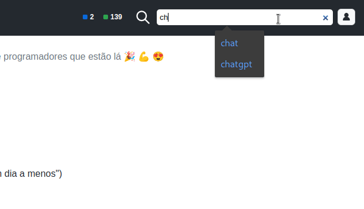

# TabBusca

Userscript that adds a search bar to tabnews.com.br



# Download

1. This is a userscript. To use it you'll first need one of the following browser extensions:

-   [Greasemonkey](https://addons.mozilla.org/pt-BR/firefox/addon/greasemonkey/) (Firefox)
-   [Tampermokey](https://www.tampermonkey.net/) (Firefox, Chrome, Safari e outros)
-   [Violentmonkey](https://violentmonkey.github.io/) (Firefox, Chrome e Edge)

2. Then install this script from one of the following links

-   [Github](https://raw.githubusercontent.com/ludwiklejzer/TabBusca/main/tabbusca.user.js) (Recommended)
-   [Greasy Fork](https://greasyfork.org/pt-BR/scripts/461020-tabbusca)

# Setting

This script gets data from google using the [All Origins](https://allorigins.win/) CORS proxy by default. You can change the proxy to [CorsAnywhere](https://github.com/Rob--W/cors-anywhere) for **testings** purposes editing the line

```javascript
let proxy = "allOrigins";
```

to

```javascript
let proxy = "corsAnywhere";
```

but use it only for tests, since this online service proxy was created just for development demonstrations. In order to enable the service you need to temporarily unlock the access in this [page](https://cors-anywhere.herokuapp.com/corsdemo).
